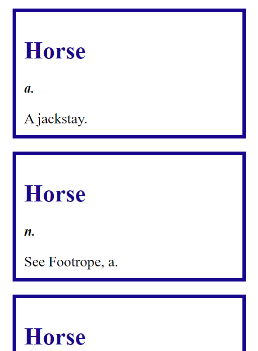
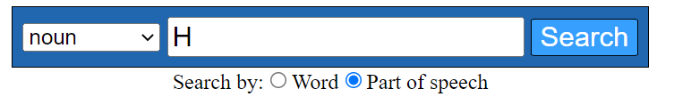

# Dictionary-client

This project is a React app, which is the front-end of a dictionary project.

You can check the deployment on AWS S3, at this URL:

http://eg-dictionary-client.s3-website-eu-west-1.amazonaws.com/

## Usage
Upon starting the app, you will land in this page:

Use the search bar to search for a word!

Searching for a word without any part of speech will result in one or more matching results, as such:

You can narrow the search for a specific word + part of speech with the part of speech dropdown element, and get a single matching word (if there is more than one, then a random matching one will be displayed each search).

You can also search for a word by a part of speech, by selecting the part of speech radio button:

Select a part of speech, search, and a random word with that part of speech will be displayed. You can also specify a starting letter, to focus the search:

Each search by part of speech, will result in a single definition of a random word that fits the conditions.

You can check the back-end repo at:

https://github.com/EhoodGoren/dictionary
